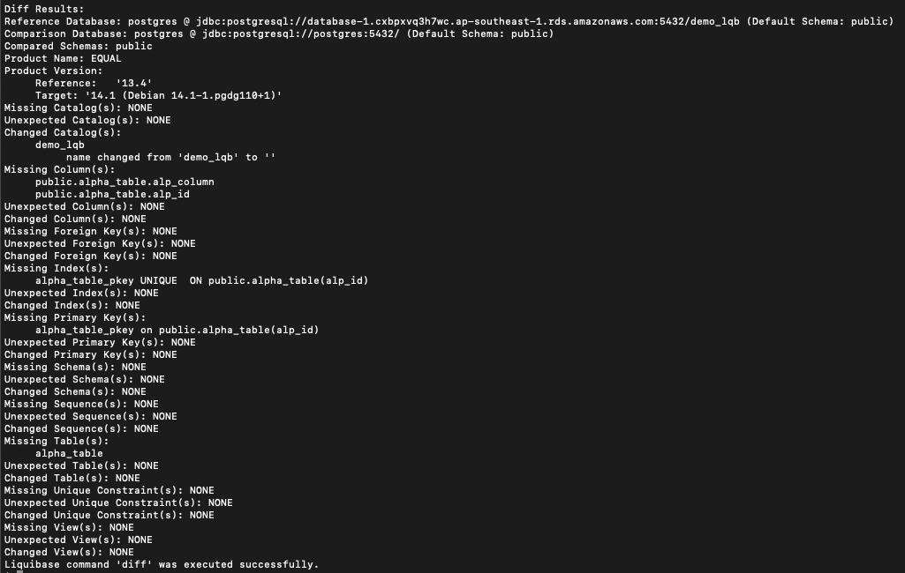
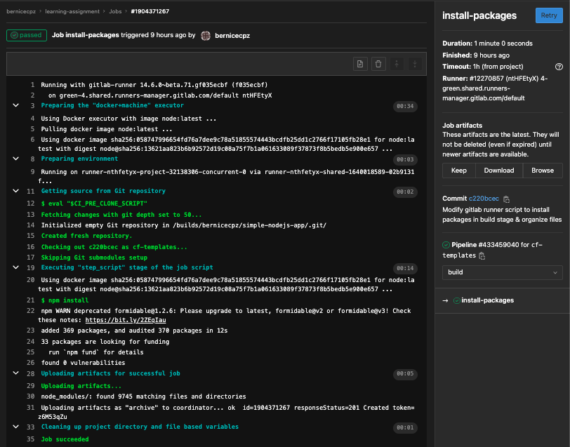
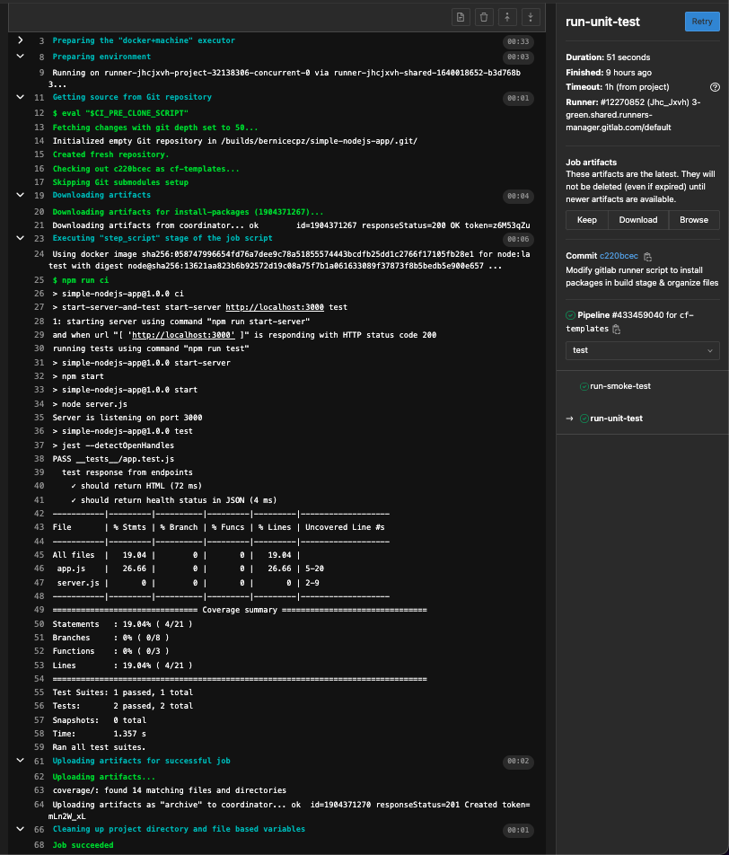

# Introduction 

## Purpose

Lorem ipsum dolor sit amet, consectetuer adipiscing elit. Aenean commodo ligula eget dolor. Aenean massa. Cum sociis natoque penatibus et magnis dis parturient montes, nascetur ridiculus mus. Donec quam felis, ultricies nec, pellentesque eu, pretium quis, sem. Nulla consequat massa quis enim. Donec pede justo, fringilla vel, aliquet nec, vulputate eget, arcu. In enim justo, rhoncus ut, imperdiet a, venenatis vitae, justo. Nullam dictum felis eu pede mollis pretium. 

Here is an example of words having a combination of bold and italics - **Integer tincidunt. Cras dapibus. _Vivamus elementum semper nisi. Aenean vulputate eleifend tellus_.** 

## Audience
The audience for this document includes:

1. Project Manager
2. Technical team such as Application Deveopers and Testers; And intentionally dummy text to match the line of point Aenean leo ligula, porttitor eu, consequat vitae, eleifend ac, enim. Aliquam lorem ante
3. System Managers

## Definitions, Terms and Acronyms

| Term  | Definition                       |
|-------|----------------------------------|
| ARN   | Amazon Resource Name             |
| AWS   | Amazon Web Service               |
| SR/CR | Service Request / Change Request |
: Definitions, Terms and Acronyms

# Some Images

